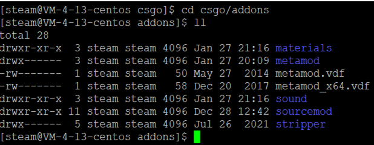

## CSGO服务器相关
---
#### 为什么会考虑搭建Csgo服务器
出于对CSGO及其衍生ZE(zombie escape)的热爱，再加上对学习的需求，让我有了搭建部署自己服务器的想法，能在玩耍中寓教于乐，何乐而不为
**学习成果：**
1. Linux系统的操作和使用
2. Vim的配置和使用
3. 简单的Shell使用
4. Screen命令的使用
5. 一台属于自己的CSGO服务器，并且能加装各种mod和运行

---
#### 服务器配置相关
1. 首先是配置文件
CSGO本地配置文件存放于
…/csgoServer/csgo/cfg/server.cfg


2. 这里必须将sv_setsteamaccount的参数修改为自己申请的密钥，不然将无法通过VAC检测并公开与社区服务器
然后根据自己需要就可以修改cfg文件
例如
服务器名字hostname、
服务器密码 sv_password、
管理员密码 rcon_password、
服务器参数等


3. 同时在服务器防火墙和出入站规则中还要开放27015端口，用于CSGO服务器的访问

---
#### 基于SourceMod和MetaMod的服务器插件管理
1. SourceMod是一个能够运行在任何基于半条命2引擎的强大模组，完成服务器管理的同时有很高的自由度选择和部署需要的脚本插件。并且基于c++和官方文档，社区创作者们可以自由的创作插件
2. MetaMod是一个插件和DLL(.so)库管理工具，允许动态加载和卸载DLL(.so)插件来增删部署于服务器上的插件
3. 这里因为要游玩的一些地图需要Stripper脚本加载，所以安装了Stripper插件。Stripper是一个小型但是能灵活的添加和删除实体的插件



---
#### 地图池配置
地图池是最重要的，有地图池才能实现地图的切换跳转。其中mapcycle.txt和maplist.txt就是存放map的名字，用于后续跳转，这里必须保证两个文件地图的名字和顺序都相同，不然无法找寻地图
地图文件存放于maps中


---
### 启动CSGO服务器
1. CSGO服务器启动位置

2. CSGO启动命令
```shell
./srcds_run
```
3. 为了能在退出远程连接后还能使服务器运行，这里需要创建一个screen
在screen中的进程并不会因为远程连接的断开而终止


---
### 进入csgo服务器
在社区服务器中查找并添加服务器地址及端口号，然后就能进入了
之前安装的SourceMod也能使用了


---
### CSGO服务器更新
就和游戏客户端一样，服务器也需要更新。服务器要更新的话，需要登录连接steam服务器后，然后输入各种指令。
这里使用了一个shell脚本，只需要执行这个脚本就能自动更新了


其中，csgo_server_update.sh就是要执行的更新脚本，update.txt就是要传入的命令
csgo_server_update.sh一开始是没有执行权限的，所以还需要输入一行命令:
```shell
chmod –x steam ./csgo_server_update.sh
```
为这个shell文件添加可执行的权限
